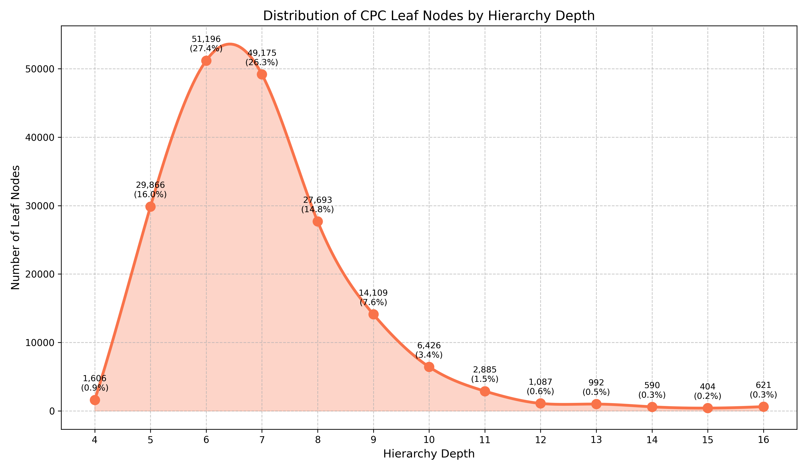
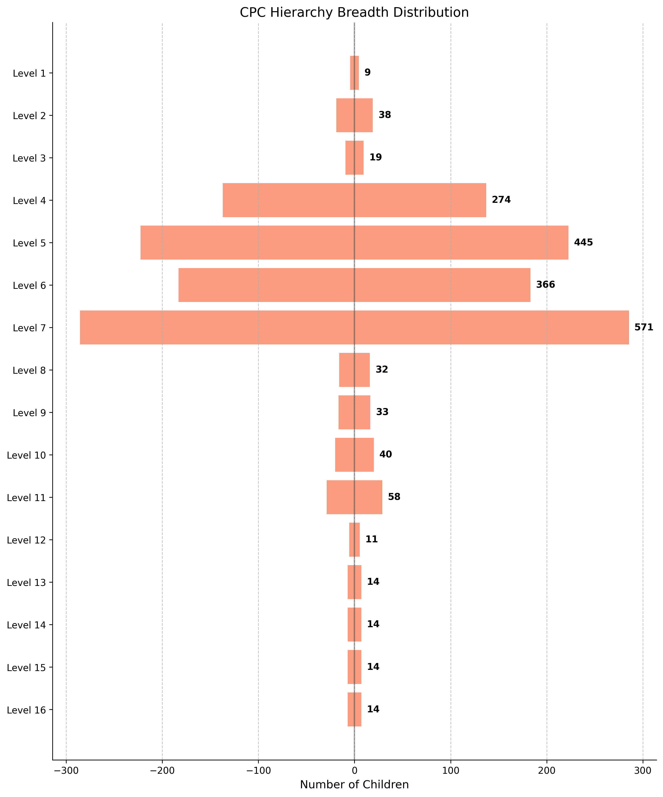

# Taxonomy to Understand AI in R&D and Scientific Invention

This project provides a suite of scripts and prompts designed to parse, analyze, and visualize the [Cooperative Patent Classification (CPC)](https://www.cooperativepatentclassification.org/) hierarchy. The goal is to build a structured, machine-readable dataset of R&D domains that can be used for large-scale analysis and classification tasks with AI models.

Why the CPC? This classification system is a highly detailed, globally recognized hierarchy for organizing patents and inventions, making it an ideal corpus for understanding the landscape of technological innovation.

The primary dataset for classification, containing full hierarchical paths, is located in `outputs/cpc_paths.tsv`.

Here is a sample from the hierarchy, demonstrating its depth and structure:

```
CPC
├── B - PERFORMING OPERATIONS; TRANSPORTING
│ └── B21 - MECHANICAL METAL-WORKING WITHOUT ESSENTIALLY REMOVING MATERIAL...
│ └── B21C - MANUFACTURE OF METAL SHEETS, WIRE, RODS, TUBES OR PROFILES...
│ ├── B21C19/00 - Devices for straightening wire or like work...
│ └── B21C26/00 - Rams or plungers; Discs therefor
├── Y - GENERAL TAGGING OF NEW TECHNOLOGICAL DEVELOPMENTS...
│ └── Y10 - TECHNICAL SUBJECTS COVERED BY FORMER USPC
│ └── Y10T - TECHNICAL SUBJECTS COVERED BY FORMER US CLASSIFICATION
│ └── Y10T442/00 - Fabric [woven, knitted, or nonwoven textile or cloth, etc.]
│ └── Y10T442/60 - Nonwoven fabric [i.e., nonwoven strand or fiber material]
│ ├── Y10T442/68 - Melt-blown nonwoven fabric
│ └── Y10T442/681 - Spun-bonded nonwoven fabric
└── H - ELECTRICITY
└── H01 - ELECTRIC ELEMENTS
└── H01L - SEMICONDUCTOR DEVICES NOT COVERED BY CLASS H10...
└── H01L25/00 - Assemblies consisting of a plurality of semiconductor or other solid state devices...
└── H01L25/03 - all the devices being of a type provided for in a single subclass...
└── H01L25/04 - the devices not having separate containers
└── H01L25/065 - the devices being of a type provided for in group H10D89/00
├── H01L25/0652 - {the devices being arranged next and on each other, i.e. mixed assemblies}
└── H01L25/0655 - {the devices being arranged next to each other}
```

The CPC hierarchy is extensive and complex, with 186,650 unique leaf nodes and paths reaching up to 16 levels deep. This project provides the tools to navigate this structure. See the full analysis of hierarchical paths in `outputs/depth_analysis/cpc_hierarchy_permutations.txt`.

Unlike narrative text, the individual classification titles can be quite concise. However, at certain levels, the number of choices ("breadth") can be large. Our analysis in `supplementary/analyze_cluster_breadth.py` shows that the maximum breadth at any single classification step is 571 options. While large, the token count for these options remains manageable for modern LLMs. See `outputs/breadth_analysis/cpc_breadth_report.txt` for more details.

The distribution of path depths and breadths is a key feature of this dataset. While a small percentage of paths are extremely deep, the majority fall within a more moderate range (5-8 levels). This distribution is crucial for estimating the computational cost of hierarchical classification tasks. Visualizations of these distributions can be found in the [Appendix](#appendix) section below.

## Prompts

Our experimental prompts for analyzing R&D-related conversations are located in `prompts/`.

- **`screener.md`**: A first-pass filter to identify conversations that relate to research, development, or invention.
- **`classification.md`**: The core prompt for mapping a technical discussion to the appropriate CPC domain. This can be used iteratively at each level of the hierarchy to pinpoint the most specific classification.
- **`inquiry_vs_invention.md`**: A facet for classifying an AI's response. It determines whether the AI is explaining existing scientific principles (**INQUIRY**) or proposing a novel device, method, or composition (**INVENTION**).
- **`novelty_score.md`**: A scoring mechanism to evaluate the novelty of a technical proposal on a scale of 1 to 5, providing a quantitative measure of inventiveness.

## Motivations & Societal Impact

As AI becomes an increasingly capable partner in scientific and technical domains, its role is shifting from a mere information retriever to a potential co-inventor. This project provides a foundational framework for systematically analyzing and understanding this shift.

By mapping AI-generated technical discussions onto the formal CPC structure, we can:
1.  **Identify Emerging R&D Trends**: Discover which areas of technology and science are most frequently discussed or innovated upon in human-AI interactions.
2.  **Assess AI's Inventive Capabilities**: Quantify the novelty and practicality of AI-generated ideas using structured prompts (`novelty_score.md`, `inquiry_vs_invention.md`).
3.  **Benchmark AI Performance**: Determine if AI models show a stronger aptitude for innovation in certain technical domains (e.g., information technology vs. mechanical engineering) over others.
4.  **Enhance Patent Search & Examination**: A system capable of accurately classifying novel ideas into the CPC hierarchy could become a powerful tool for patent examiners and inventors, accelerating prior art searches and improving the quality of patent applications.

Understanding the contours of AI's inventive capacity is crucial. It allows us to build better tools, direct research efforts more effectively, and anticipate the societal and economic impacts of AI-driven innovation. This project aims to create the open, structured data necessary to begin asking and answering these critical questions.

## Appendix

*Figure 1. Smoothed distribution of path-depths across all CPC leaf nodes.*



*Figure 2. Vertical bar chart of maximum classification options (breadth) at each level of the hierarchy.*



## Project Structure
```
.
├── data/
│   └── cpc_title_lists/
│       └── cpc-section-A_20250501.txt
├── main.py
├── README.md
├── requirements.txt
├── outputs/
│   ├── breadth_analysis/
│   ├── depth_analysis/
│   ├── taxonomy/
│   ├── cpc_hierarchy.json
│   ├── cpc_paths.tsv
│   ├── echarts_data.json
│   └── visualize_cpc.html
├── prompts/
│   ├── classification.md
│   ├── inquiry_vs_invention.md
│   ├── novelty_score.md
│   └── screener.md
└── scripts/
    ├── cpc_parser.py
    └── supplementary/
        ├── analyze_cluster_breadth.py
        ├── analyze_hierarchy_permutations.py
        ├── prepare_for_echarts.py
        └── sample_hierarchy.py
```

## Usage

### Main Processing Pipeline

1.  Download all the files from [Cooperative Patent Classification (CPC) Title List] (https://www.cooperativepatentclassification.org/cpcSchemeAndDefinitions/bulk) (titled `cpc-section-*.txt`) in the `data/cpc_title_lists/` directory.
2.  Install the required Python libraries:
    ```bash
    pip install -r requirements.txt
    ```
3.  Run the main orchestrator script from the project root:
    ```bash
    python3 main.py
    ```
    This single command will parse the data and run all supplementary analyses.

### Interactive Visualization

After running the main pipeline, a file named `echarts_data.json` will be created in the `outputs/` directory. To view the interactive tree:

1.  From within the `outputs/` directory, start a local web server:
    ```bash
    # For Python 3
    python3 -m http.server
    ```
2.  Open a web browser and navigate to `http://localhost:8000/visualize_cpc.html`.